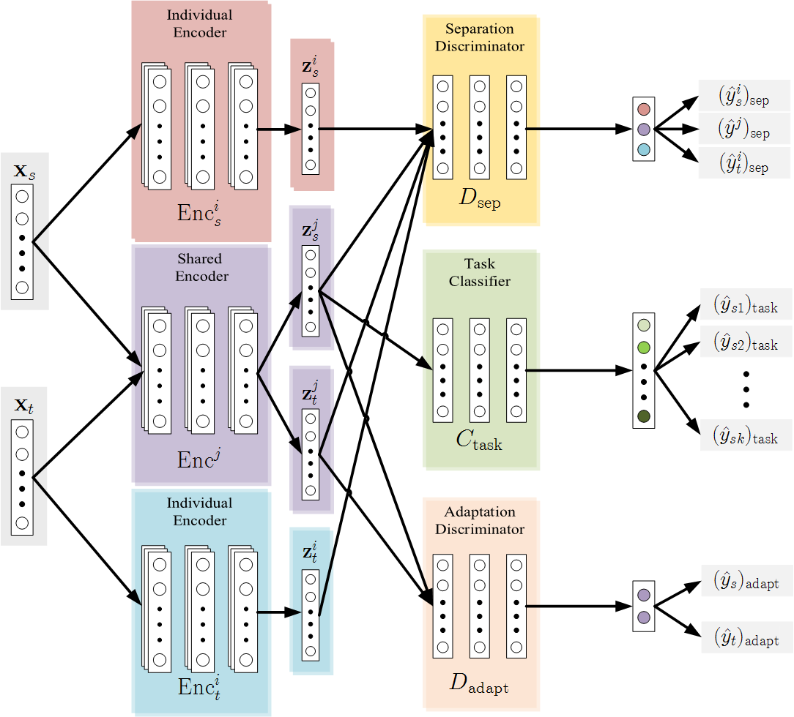
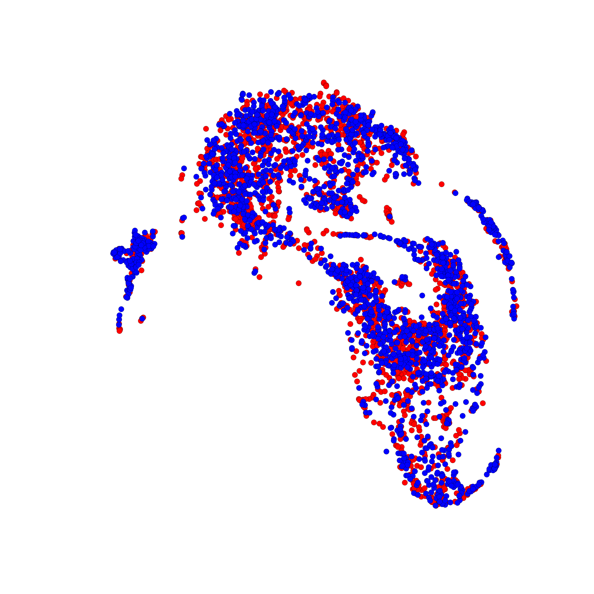
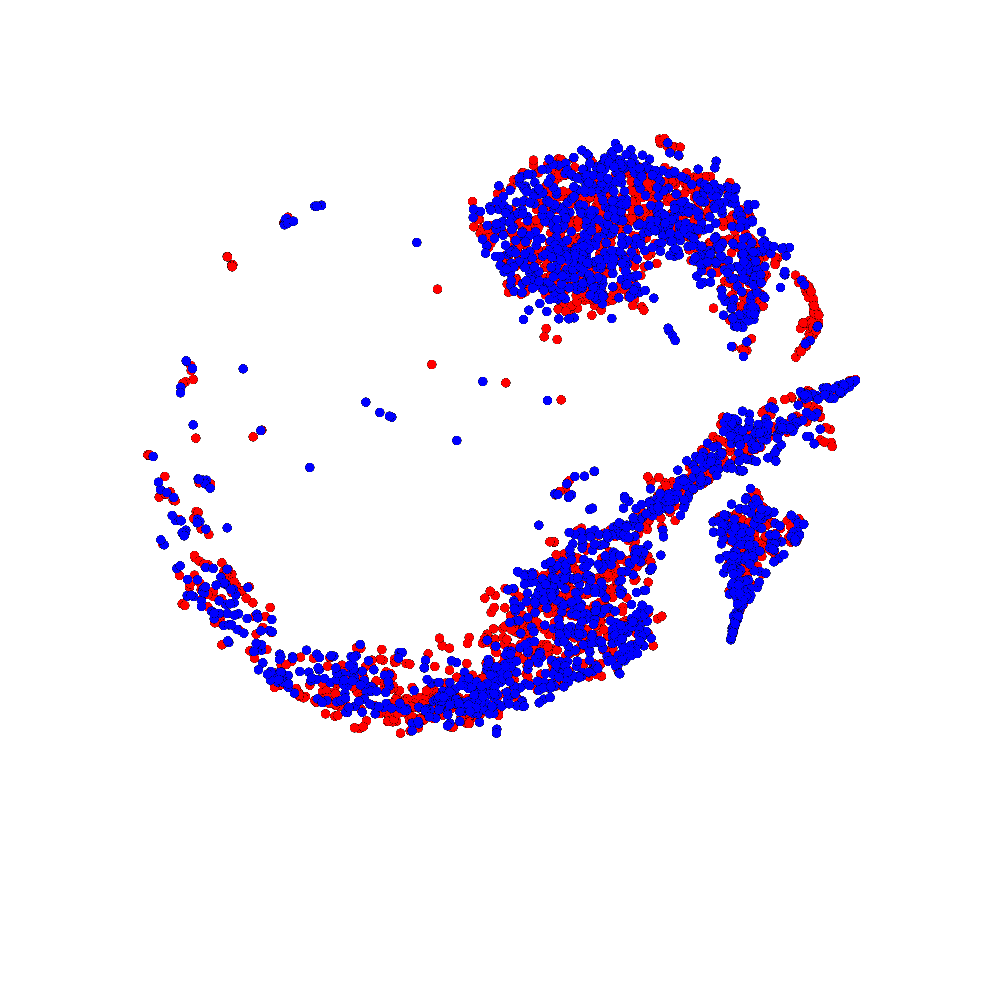
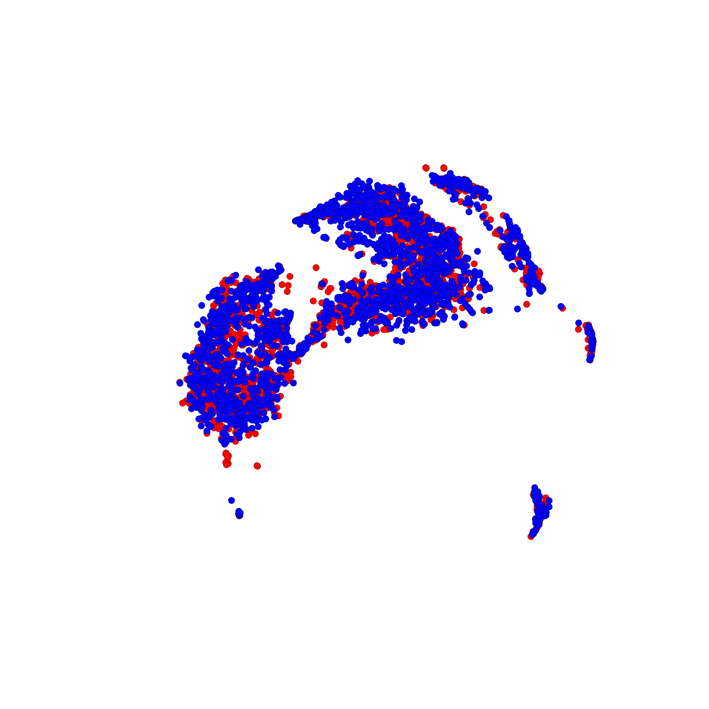
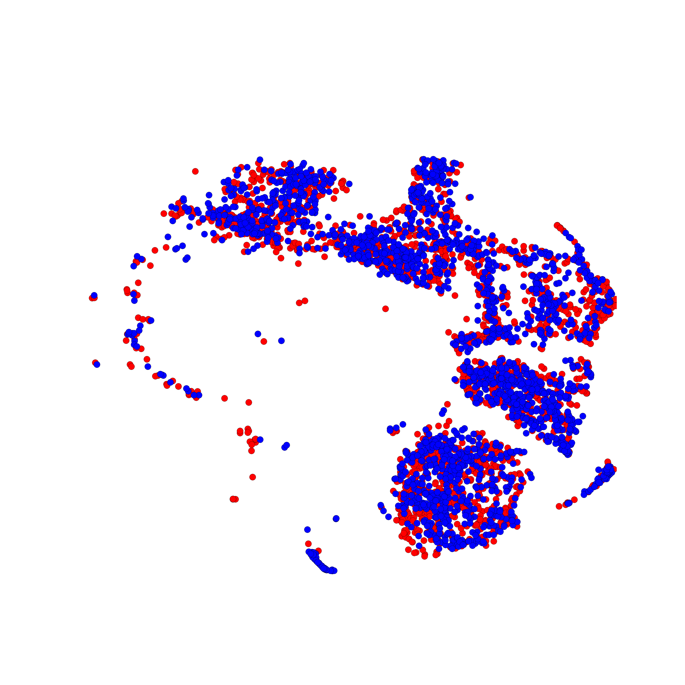

## Adversarial Domain Separation and Adaptation
In this project, we implement Adversarial Domain Separation and Adaptation on sentiment classification for Amazon Reviews.

## Setting
- Hardware:
	- CPU:Intel Core i7-4930k @3.40GHz
	- RAM: 32GB DDR3-1600
	- GPU: NVIDIA TITAN X 6GB RAM

- Tensorflow: 0.12

- Dataset:
	- Amazon Review: [ link ](https://www.cs.jhu.edu/~mdredze/datasets/sentiment/) (Please download the processed_acl.tar.gz)

## Result
- Classification Accuracies (\%) for adaptation among different domains

| Source      | Target      | Baseline         | VFAE            | DAN                 | DSN            | ADSA                |
|-------------|-------------|:----------------:|:---------------:|:-------------------:|:--------------:|:-------------------:|
| Books       | DVDs        | 77.2             | 77.6            | 78.4                | 78.2           | 80.2                |
| Books       | Electronics | 70.3             | 69              | 73.3                | 71.8           | 78.3                |
| Books       | Kitchen     | 72.8             | 70.3            | 77.9                | 76.6           | 81.3                |
| DVDs        | Books       | 74.2             | 71.4            | 72.3                | 73.6           | 76.4                |
| DVDs        | Electronics | 71.8             | 71.2            | 75.4                | 74.8           | 77.7                |
| DVDs        | Kitchen     | 75.6             | 73.5            | 78.3                | 79.7           | 80.1                |
| Electronics | Books       | 70.9             | 68.8            | 71.1                | 69.7           | 72.6                |
| Electronics | DVDs        | 67.9             | 69.7            | 73.8                | 74.1           | 74.5                |
| Electronics | Kitchen     | 73               | 81.5            | 85.4                | 86.4           | 85.5                |
| Kitchen     | Books       | 66.9             | 66.8            | 70.9                | 69.4           | 72.5                |
| Kitchen     | DVDs        | 68               | 68.4            | 74                  | 71.3           | 75.8                |
| Kitchen     | Electronics | 82.5             | 82.4            | 84.3                | 83             | 83.6                |
| average     |             | 72.59167         | 72.55           | 76.25833            | 75.71667       | 78.20833            |

-Visualization of shared features by t-SNE

||
|:---------------------------------------------------------------:|:------------------------------------------------------------------------:
Books to DVDs                                                     |Books to Electronics

||
|:---------------------------------------------------------------:|:---------------------------------------------------------------------:
Books to kitchen                                                  |DVDs to Books 
