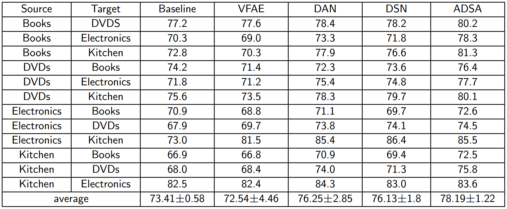
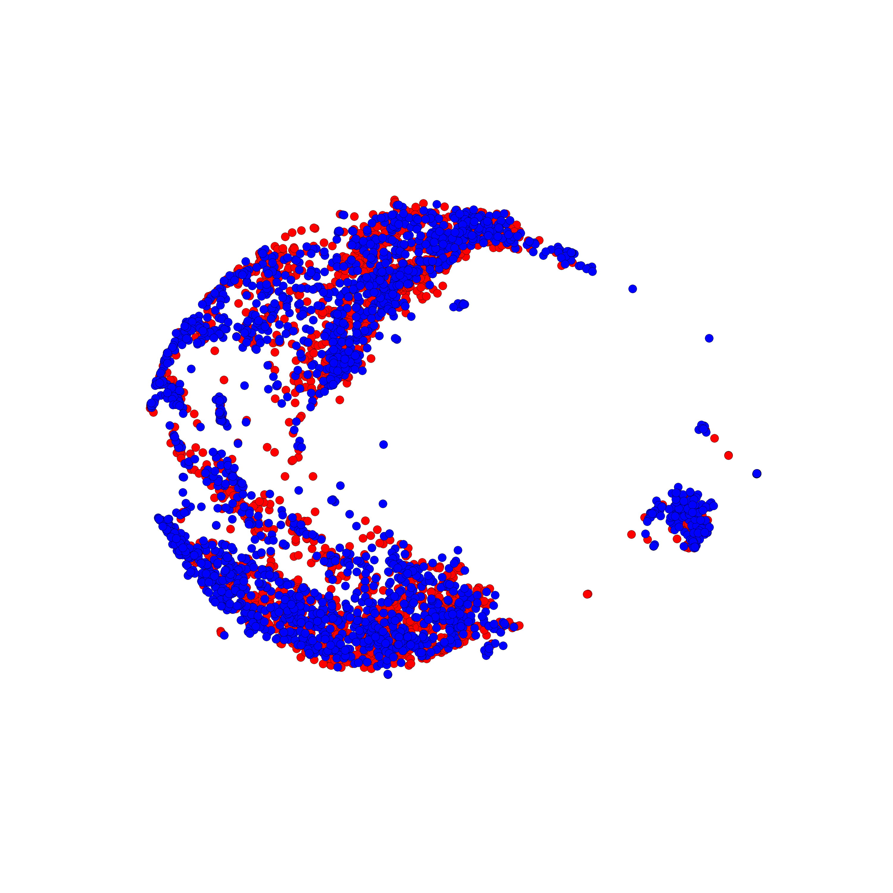
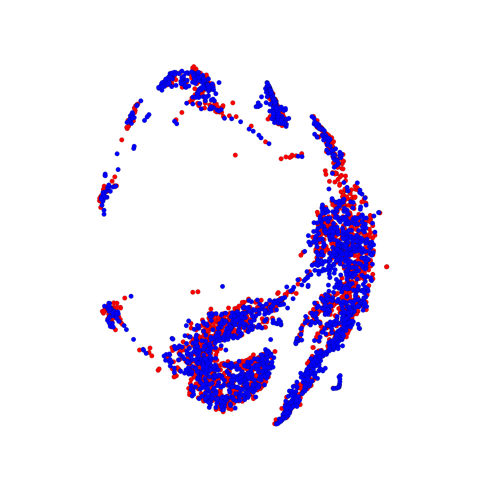
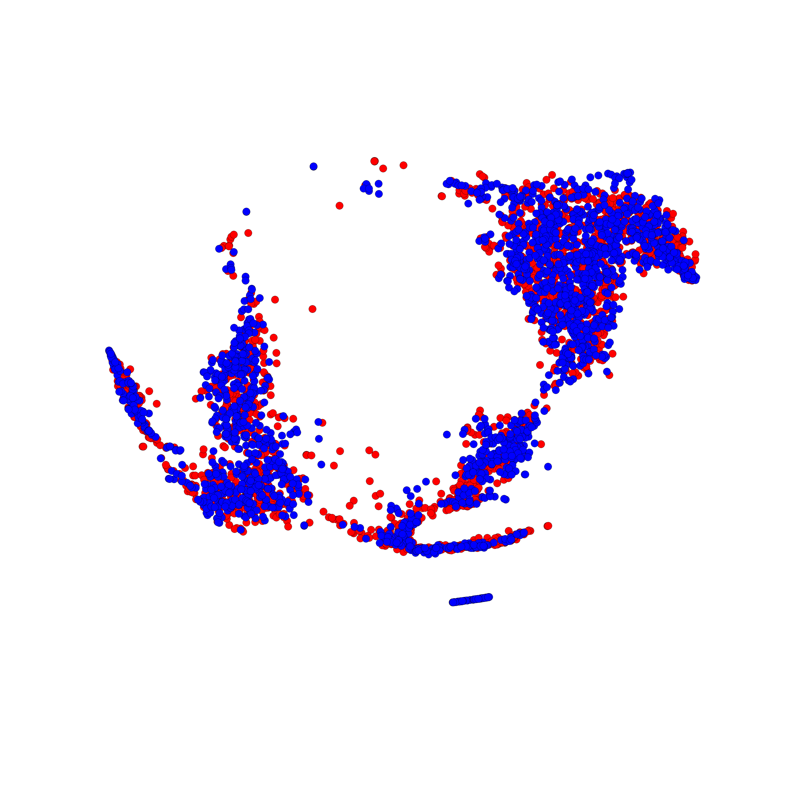
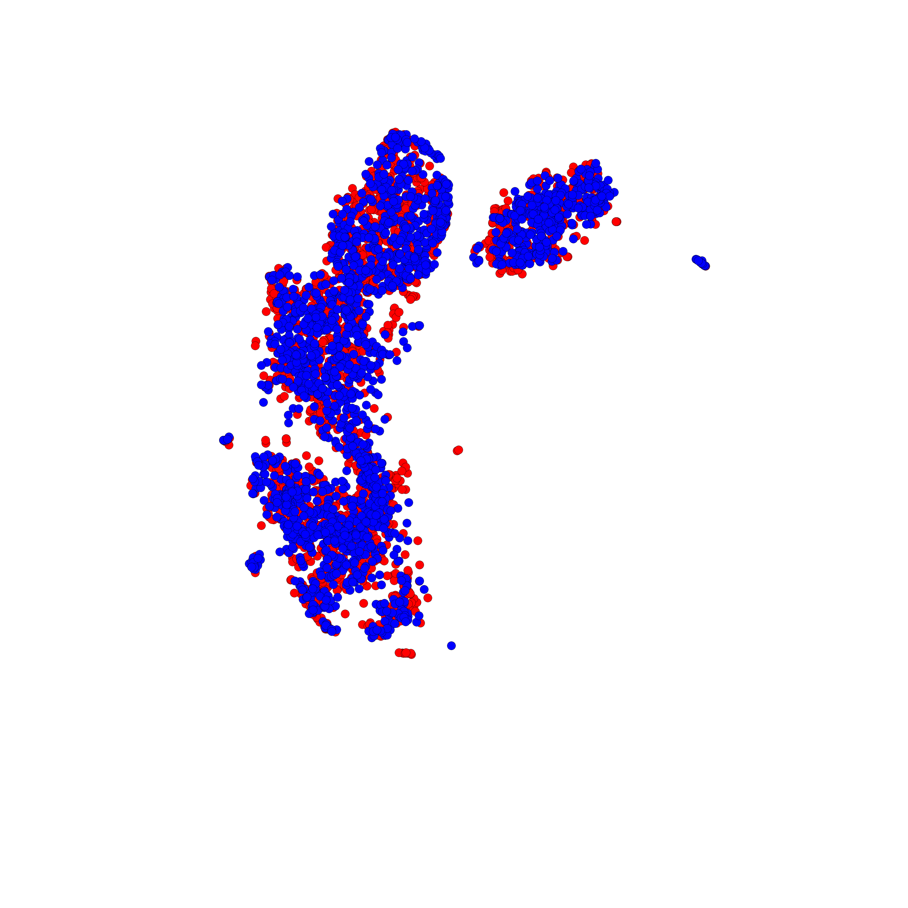
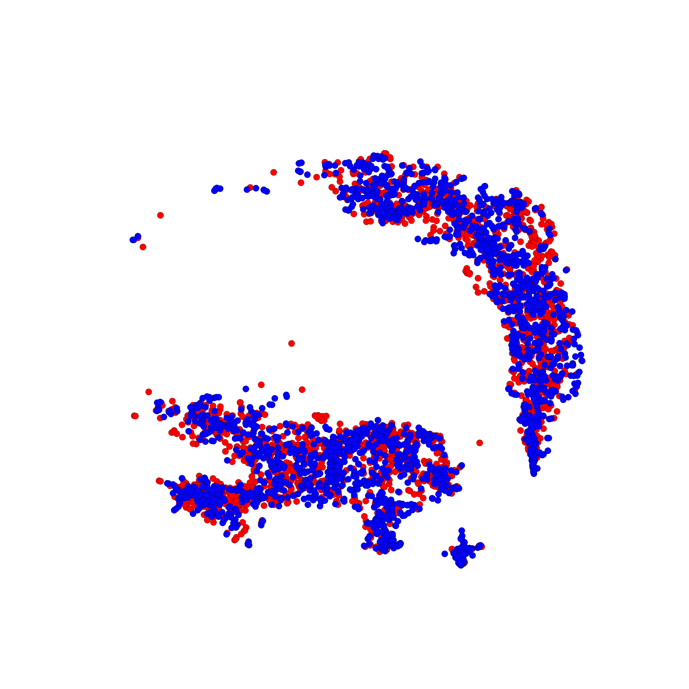
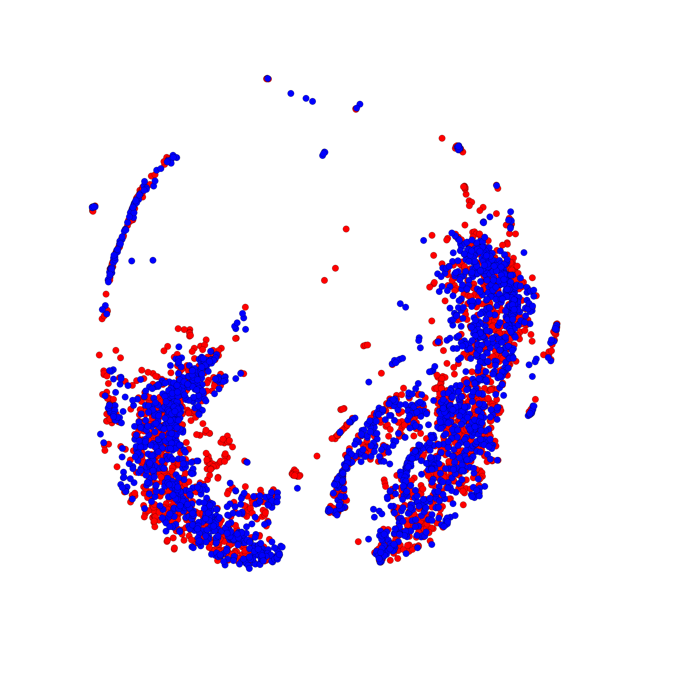
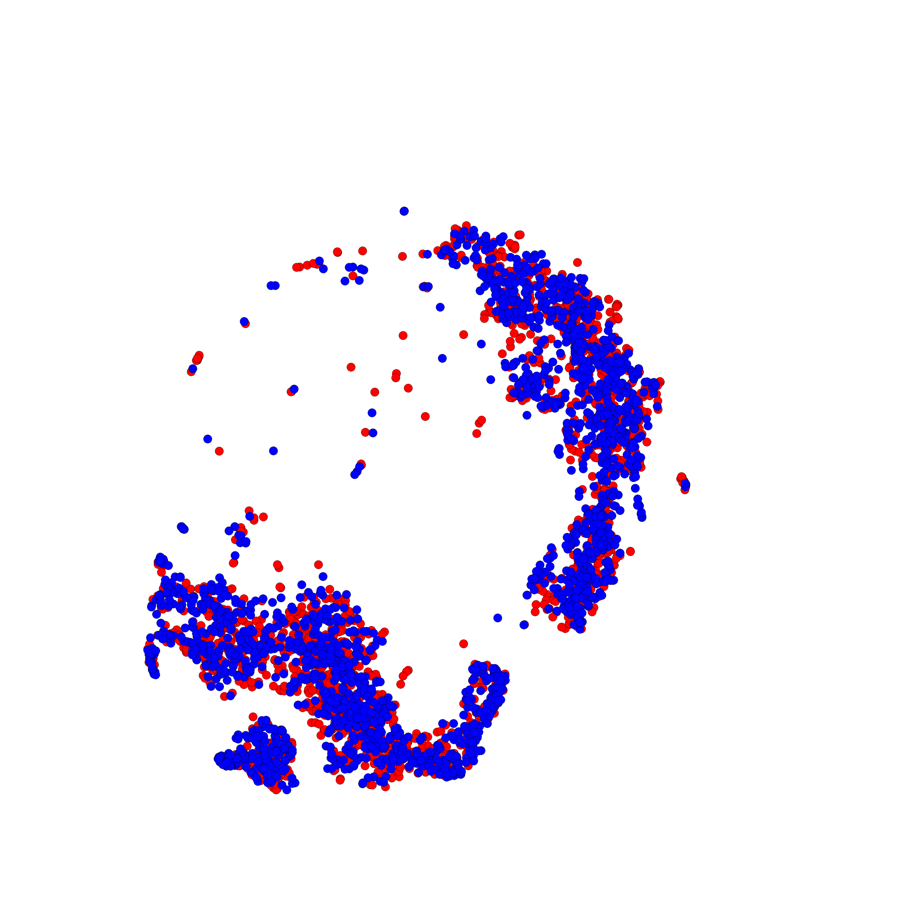

## Adversarial Domain Separation and Adaptation
In this project, we implement Adversarial Domain Separation and Adaptation on sentiment classification for Amazon Reviews.

## Setting
- Hardware:
	- CPU:Intel Core i7-4930k @3.40GHz
	- RAM: 32GB DDR3-1600
	- GPU: NVIDIA TITAN X 6GB RAM

- Tensorflow: 0.12

- Dataset:
	- Amazon Review: [ link ](https://www.cs.jhu.edu/~mdredze/datasets/sentiment/) (Please download the processed_acl.tar.gz)

## Result
- Classification Accuracies (\%) for adaptation among different domains

-Visualization of shared features by t-SNE.(RED: source domain , BLUE: target domain)

||
|:---------------------------------------------------------------:|:------------------------------------------------------------------------:
Books to DVDs                                                     |Books to Electronics

||
|:---------------------------------------------------------------:|:---------------------------------------------------------------------:
Books to Kitchen                                                  |DVDs to Books

||
|:---------------------------------------------------------------:|:---------------------------------------------------------------------:
DVDs to Electronics                                               |DVDs to Kitchen

||
|:---------------------------------------------------------------:|:---------------------------------------------------------------------:
Electronics to Books                                              |electronics to DVDs

||
|:---------------------------------------------------------------:|:---------------------------------------------------------------------:
Electronics to Kitchen                                            |Kitchen to Books

||
|:---------------------------------------------------------------:|:---------------------------------------------------------------------:
Kitchen to DVDs                                                   |Kitchen to Electronics

